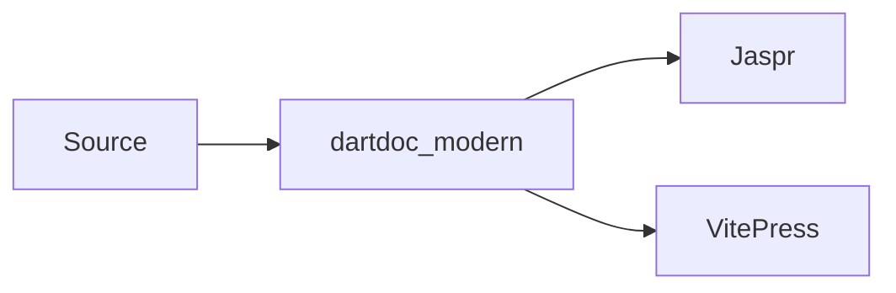

# Getting Started

dartdoc_modern is a drop-in replacement for `dart doc` that generates a modern documentation site with search, dark mode, guide pages, and interactive blocks.

## Install

```bash
dart pub global activate dartdoc_modern
```

## Quick Start

<Tabs defaultValue="jaspr">
  <TabItem label="Jaspr" value="jaspr">

```bash
dartdoc_modern --format jaspr --output docs-site
cd docs-site && dart pub get && jaspr serve
```

Open [http://localhost:8080](http://localhost:8080) to preview.

  </TabItem>
  <TabItem label="VitePress" value="vitepress">

```bash
dartdoc_modern --format vitepress --output docs-site
cd docs-site && npm install && npx vitepress dev
```

Open [http://localhost:5173](http://localhost:5173) to preview.

  </TabItem>
</Tabs>

That's it. Your API docs are ready with full-text search, dark mode, and sidebar navigation.

## Output Formats

dartdoc_modern supports two output formats. Both produce the same API documentation from the same source code.

| | Jaspr | VitePress |
|---|---|---|
| Stack | Dart + SSR | Node + Vue |
| Preview | `jaspr serve` | `npx vitepress dev` |
| Build | `jaspr build` | `npx vitepress build` |
| Extend with | Dart components | Vue components, markdown-it plugins |
| Best for | Dart/Flutter teams | Teams comfortable with Node |

Choose **Jaspr** if you want everything in Dart. Choose **VitePress** if you want the mature static-site ecosystem.

See [Jaspr vs VitePress](/guide/jaspr-vs-vitepress) for a deeper comparison.

## Workspace / Mono-repo

For Dart workspaces with multiple packages:

```bash
dartdoc_modern --format jaspr \
  --workspace-docs \
  --exclude-packages 'example,test_utils' \
  --output docs-site
```

The generator reads the `workspace:` key from your root `pubspec.yaml` and builds a unified docs site with per-package navigation.

Use `--exclude-packages` to skip packages that don't need documentation (examples, test utilities, internal tools).

## Writing Guide Pages

Any markdown file in `doc/` or `docs/` becomes a guide page in the sidebar.

```text
my_package/
  lib/
  doc/
    getting-started.md
    configuration.md
    advanced/
      custom-themes.md
      plugins.md
  pubspec.yaml
```

### Frontmatter

Use YAML frontmatter to control ordering and titles:

```yaml
---
sidebar_position: 1
title: Configuration
---
```

- `sidebar_position` - lower numbers appear first in the sidebar. Pages without a position are sorted alphabetically after positioned ones.
- `title` - overrides the sidebar label. If omitted, the first `# heading` or the filename is used.

### Subdirectories

Subdirectories become collapsible groups in the sidebar. An `index.md` inside a subdirectory sets the group title and landing page.

### Visibility

To keep a guide out of the generated site, add to frontmatter:

```yaml
---
internal: true
---
```

Internal guides stay in your repository but are excluded from generation.

## Guide Features

### DartPad Embeds

Annotate a Dart code block with `dartpad` to make it interactive:

````
```dartpad
void main() {
  print('Hello from DartPad!');
}
```
````

See [DartPad Embeds](/guide/dartpad-embeds) for options like `theme`, `run`, and height control.

### Mermaid Diagrams

Use `mermaid` code blocks for diagrams:

````

````

### Callouts

:::tip
Use callouts with `:::tip`, `:::info`, `:::warning`, or `:::danger` syntax.
:::

### Tabs

```html
<Tabs defaultValue="a">
  <TabItem label="Option A" value="a">
  Content for A.
  </TabItem>
  <TabItem label="Option B" value="b">
  Content for B.
  </TabItem>
</Tabs>
```

### Auto-Linking

Backtick references to API symbols are automatically linked to the corresponding API page. Write `` `MyClass` `` in a guide and it becomes a clickable link.

## Configuration

### CLI Flags

Key flags beyond `--format` and `--output`:

| Flag | Description |
|---|---|
| `--workspace-docs` | Generate docs for all workspace packages |
| `--exclude-packages` | Skip specific packages (comma-separated) |
| `--exclude` | Exclude specific libraries by name |
| `--include` | Only include specific libraries |
| `--sdk-docs` | Generate docs for the Dart SDK itself |
| `--guide.dirs` | Directories to scan for guides (default: `doc,docs`) |
| `--guide.include` | Regex patterns to include guide files |
| `--guide.exclude` | Regex patterns to exclude guide files |
| `--favicon` | Path to a custom favicon |
| `--no-validate-links` | Skip link validation (faster builds) |

### dartdoc_options.yaml

Most options can be set in `dartdoc_options.yaml` at your package root. CLI flags override file settings.

```yaml
dartdoc:
  categories:
    - name: Core
      markdown: doc/categories/core.md
  categoryOrder: ["Core", "Utilities"]
  exclude:
    - "internal_library"
```

## Deployment

### VitePress

Build and deploy the dist folder:

```bash
cd docs-site
npx vitepress build
# deploy docs-site/.vitepress/dist
```

### Jaspr

Build the static site with `jaspr build`:

```bash
cd docs-site
dart pub get
jaspr build
# deploy docs-site/build/jaspr
```

For subpath hosting (e.g. `https://user.github.io/my-package/`):

```bash
jaspr build --dart-define DOCS_BASE_PATH=/my-package
```

See [Jaspr Deployment](/guide/jaspr-deployment) for GitHub Actions workflow examples and hosting guides.

## dart doc vs dartdoc_modern

| | dart doc | dartdoc_modern |
|---|---|---|
| Output | Static HTML | VitePress or Jaspr site |
| Search | Basic | Full-text, offline |
| Dark mode | No | Yes |
| Guide pages | No | Auto from `doc/` |
| Mono-repo | No | `--workspace-docs` |
| File count | One page per member | Members inline on type page |
| DartPad embeds | No | Yes |
| Mermaid diagrams | No | Yes |

### Why It Builds Faster

`dart doc` creates a separate HTML page for every method, property, constructor, and constant. `dartdoc_modern` keeps members inline on the library or type page.

- Flutter `Icons` class: ~2,000 constants = ~2,001 pages in `dart doc`, 1 page in `dartdoc_modern`
- Full Dart SDK: ~15,000 HTML files vs ~1,800 markdown files

## Live Examples

- [Dart SDK API docs](https://777genius.github.io/dart-sdk-api/) - full Dart SDK generated with dartdoc_modern
