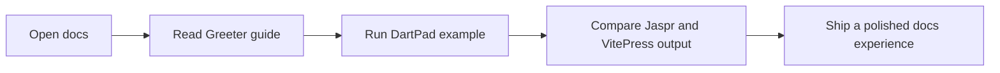
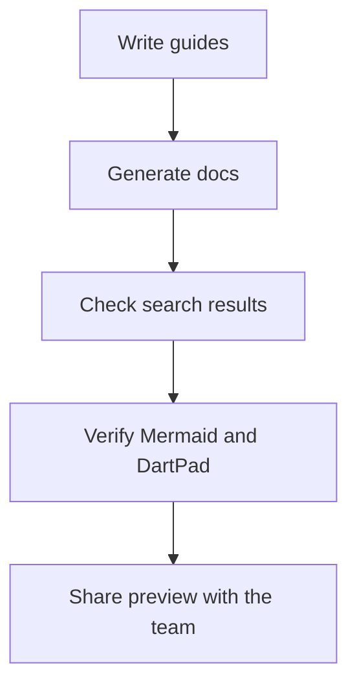

# Getting Started

Welcome to the expanded showcase package.

This fixture exists to compare `jaspr` and `vitepress` output on a package that is large enough to exercise real docs UX:

- guide sidebar generation
- multi-library API navigation
- inline API linking for `Greeter`, `Pipeline`, and `ShowcasePageSpec`
- callouts and collapsible sections
- imported snippets
- Mermaid diagrams
- DartPad embeds
- richer `On this page` behavior

## Installation

Add the package to your `pubspec.yaml`.

Use `Greeter` when you want to create greetings from a reusable template.
When you need staged transformations, pair it with `Pipeline`.

### Minimal Setup

The quickest path is to start with `createDefaultGreeter()` and only customize the template later.

:::tip Quick Start
This guide shows how `Greeter` behaves in docs-friendly examples.
A small Unicode fixture is included for search verification: `Пример`.
:::

### First Delivery Flow

The `deliver` method returns a `GreetingResult`, which is helpful for UI-driven docs and richer testing scenarios.

:::info Why This Matters
Returning structured objects gives the docs site more interesting API pages than a package made of only trivial functions.
:::

## Embedded Playground

### Basic Greeter Example

```dartpad height=420 run=false
void main() {
  final names = ['Ada', 'Linus', 'Grace'];
  for (final name in names) {
    print('Hello, $name!');
  }
}
```

### Pipeline Example

This example mirrors the `Pipeline` API and gives the search index more realistic content to rank.

```dartpad height=420 run=false
void main() {
  final value = ['draft', 'reviewed', 'published']
      .map((step) => step.toUpperCase())
      .join(' -> ');

  print(value);
}
```

## Imported Snippet

### Greeter Helper

<<< snippets/hello.dart#L1-L7

### Pipeline Helper

<<< snippets/pipeline_showcase.dart#L1-L18

## Mermaid Flow

### Reading Path



### Release Checklist



## UI Showcase

The UI-oriented API pages are deliberately larger than the original fixture.

### Why Include UI Models

`ShowcasePageSpec` and `CardSection` make the docs site feel closer to a real package with navigation, visual states, and structured domain types.

### Outline Depth

This subsection exists specifically to make the `On this page` sidebar deeper and more comparable to VitePress.

#### Fine-Grained Navigation

Scrolling should highlight the active section and keep the selected item visible in the outline.

## Next Steps

Read the advanced guides for configuration, architecture, and recipes.

:::details Suggested path
- Start with `advanced/configuration.md`
- Then read `advanced/architecture.md`
- Finish with the `recipes/` guides
:::
