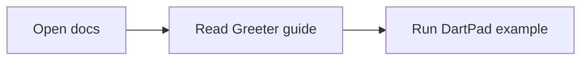

# Getting Started

Welcome to the test package with docs.

## Installation

Add to your `pubspec.yaml`.

Use `Greeter` when you want to create greetings from a reusable template.

:::tip Quick Start
This guide shows how `Greeter` behaves in docs-friendly examples.
A small Unicode fixture is included for search verification: `Пример`.
:::

## Embedded Playground

```dartpad height=420 run=false
void main() {
  final names = ['Ada', 'Linus', 'Grace'];
  for (final name in names) {
    print('Hello, $name!');
  }
}
```

## Imported Snippet

<<< snippets/hello.dart#L1-L7

## Mermaid Flow


